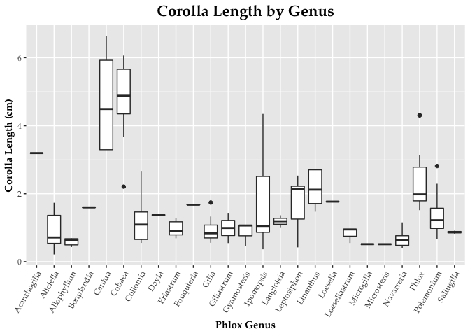

**Installing Libraries if Necessary (for non-frequent R users)

```r
if (!require("tidyverse")) install.packages('tidyverse')
if (!require("RColorBrewer")) install.packages('RColorBrewer')
if (!require("paletteer")) install.packages('paletteer')
if (!require("janitor")) install.packages('janitor')
if (!require("here")) install.packages('here')
if (!require("naniar")) install.packages('naniar')
if (!require("stringr")) install.packages('stringr')
if (!require("shiny")) install.packages('shiny')
if (!require("shinydashboard")) install.packages('shinydashboard')
```

#Library

```r
library(tidyverse)
library(RColorBrewer)
library(paletteer)
library(janitor)
library(here)
library(naniar)
library(stringr)
library(shiny)
library(shinydashboard)
```

#Loading Original Data Sets and Cleaning Names
The following data sets examine the pollinators, colors, and sizes associated with different species of flowers within the phlox family. Source: Landis, Jacob B. et al. (2018), Evolution of floral traits and impact of reproductive mode on diversification in the phlox family (Polemoniaceae), Molecular Phylogenetics and Evolution, Article-journal, https://doi.org/10.1016/j.ympev.2018.06.035
[Data:](https://datadryad.org/stash/dataset/doi:10.5061/dryad.2710pk5)

```r
flower_sizes_original <- read_csv(here("group4_project_geralin_natascha_jala_files", "Plant+Pollinators Data", "Flower size measurements.csv")) %>%
  janitor::clean_names()
colors_and_pollinators_original <- read_csv(here("group4_project_geralin_natascha_jala_files", "Plant+Pollinators Data", "Pollinator and flower color.csv")) %>%
  janitor::clean_names()
```

#Flower Sizes Data
With the first data set, we'll observe the lengths and widths of each species' corollas, removing any NAs recorded for these variables.

```r
flower_sizes <- flower_sizes_original %>% 
  select(herbarium_accession_sheet, species, flower_number, corolla_length_cm, corolla_width_throat_cm) %>% 
  filter(corolla_length_cm != "NA", corolla_width_throat_cm != "NA")
flower_sizes
```

```
# A tibble: 3,006 x 5
   herbarium_accessio… species   flower_number corolla_length_… corolla_width_t…
   <chr>               <chr>             <dbl>            <dbl>            <dbl>
 1 Acanthogilia glori… Acanthog…             1             3.55            0.393
 2 Acanthogilia glori… Acanthog…             1             3.70            0.455
 3 Acanthogilia glori… Acanthog…             2             2.66            0.37 
 4 Acanthogilia glori… Acanthog…             3             2.87            0.375
 5 Aliciella caespito… Aliciell…             1             1.65            0.241
 6 Aliciella caespito… Aliciell…             2             1.66            0.148
 7 Aliciella caespito… Aliciell…             3             1.88            0.201
 8 Aliciella formosa … Aliciell…             1             1.97            0.201
 9 Aliciella formosa … Aliciell…             2             2.12            0.286
10 Aliciella formosa … Aliciell…             3             2.05            0.23 
# … with 2,996 more rows
```
##Checking classes of variables, making changes as necessary

```r
glimpse(flower_sizes)
```

```
Rows: 3,006
Columns: 5
$ herbarium_accession_sheet <chr> "Acanthogilia gloriosa KANU00172801", "Acant…
$ species                   <chr> "Acanthogilia gloriosa", "Acanthogilia glori…
$ flower_number             <dbl> 1, 1, 2, 3, 1, 2, 3, 1, 2, 3, 1, 2, 3, 1, 2,…
$ corolla_length_cm         <dbl> 3.552, 3.696, 2.660, 2.874, 1.652, 1.664, 1.…
$ corolla_width_throat_cm   <dbl> 0.393, 0.455, 0.370, 0.375, 0.241, 0.148, 0.…
```

Changing `species` from character to factor: 

```r
flower_sizes$species <- as.factor(flower_sizes$species)
is.factor(flower_sizes$species)
```

```
[1] TRUE
```


```r
flower_sizes %>%
  miss_var_summary() #To confirm that we have removed all NAs represented as "NA" from the size columns, as well as to get a count of any other NAs in the remaining columns
```

```
# A tibble: 5 x 3
  variable                  n_miss pct_miss
  <chr>                      <int>    <dbl>
1 herbarium_accession_sheet      0        0
2 species                        0        0
3 flower_number                  0        0
4 corolla_length_cm              0        0
5 corolla_width_throat_cm        0        0
```

#Calculate the means, standard deviations and length to width ratios of the corollas of each species:

```r
flower_sizes_calculated <- flower_sizes %>% 
  group_by(species) %>% 
  summarise(mean_corolla_length_cm = mean(corolla_length_cm, na.rm = TRUE),
         std_dev_corolla_length = sd(corolla_length_cm, na.rm = TRUE),
         mean_corolla_width_throat_cm = mean(corolla_width_throat_cm, na.rm = TRUE),
         std_dev_corolla_width_throat = sd(corolla_width_throat_cm, na.rm = TRUE),
         mean_length_width_ratio = mean_corolla_length_cm/mean_corolla_width_throat_cm)
flower_sizes_calculated #summary of sizes for each species, with means, standard deviations, and ratios calculated
```

```
# A tibble: 396 x 6
   species  mean_corolla_len… std_dev_corolla… mean_corolla_wi… std_dev_corolla…
 * <fct>                <dbl>            <dbl>            <dbl>            <dbl>
 1 Acantho…             3.20            0.506            0.398            0.0391
 2 Aliciel…             1.73            0.131            0.197            0.0467
 3 Aliciel…             2.12            0.0894           0.297            0.0645
 4 Aliciel…             1.58            0.408            0.209            0.0706
 5 Aliciel…             1.11            0.295            0.145            0.0258
 6 Aliciel…             0.818           0.129            0.158            0.0640
 7 Aliciel…             0.556           0.0207           0.0963           0.0205
 8 Aliciel…             0.518           0.110            0.0963           0.0220
 9 Aliciel…             0.636           0.0187           0.128            0.0255
10 Aliciel…             0.665           0.0471           0.141            0.0122
# … with 386 more rows, and 1 more variable: mean_length_width_ratio <dbl>
```


```r
n_distinct(flower_sizes_calculated$species)
```

```
[1] 396
```

There are 396 species in our flower sizes data sheet. Object `flower_sizes_calculated` should be used for the merge. 

#Pollinator and Color Data
With our second data set, we'll observe the different colors and pollinators associated with each species. Note: this data is not yet clean.

```r
colors_and_pollinators <- colors_and_pollinators_original %>% 
  rename(color_source="source", pollinator_source="source_1") %>% 
  filter(pollinator != "NA")
colors_and_pollinators 
```

```
# A tibble: 192 x 5
   species         color    color_source    pollinator         pollinator_source
   <chr>           <chr>    <chr>           <chr>              <chr>            
 1 Acanthogilia g… white    Hsu and Hall 2… hummingbird        Hsu and Hall 2003
 2 Aliciella caes… red      Porter 1998     hummingbird        Grant and Grant …
 3 Aliciella hutc… white    Porter 1998     autogamous         Grant and Grant …
 4 Aliciella lept… white    Porter 1998     autogamous         Grant and Grant …
 5 Aliciella micr… white    Porter 1998     autogamous         Grant and Grant …
 6 Aliciella pinn… blue     Porter 1998     bee                Grant and Grant …
 7 Aliciella subn… red      Porter 1998     hummingbird        Grant and Grant …
 8 Allophyllum di… pink     Jepson Online   beefly             Grant and Grant …
 9 Allophyllum gi… blue-pu… Jepson Online   autogamous         Grant and Grant …
10 Allophyllum gl… blue-pu… Jepson Online   bee primary, seco… Grant and Grant …
# … with 182 more rows
```
##Checking classes of variables, making changes as necessary

```r
glimpse(colors_and_pollinators)
```

```
Rows: 192
Columns: 5
$ species           <chr> "Acanthogilia gloriosa", "Aliciella caespitosa", "Al…
$ color             <chr> "white", "red", "white", "white", "white", "blue", "…
$ color_source      <chr> "Hsu and Hall 2003", "Porter 1998", "Porter 1998", "…
$ pollinator        <chr> "hummingbird", "hummingbird", "autogamous", "autogam…
$ pollinator_source <chr> "Hsu and Hall 2003", "Grant and Grant 1965", "Grant …
```


```r
colors_and_pollinators$species <- as.factor(colors_and_pollinators$species)
is.factor(colors_and_pollinators$species)
```

```
[1] TRUE
```

```r
colors_and_pollinators$color <- as.factor(colors_and_pollinators$color)
is.factor(colors_and_pollinators$color)
```

```
[1] TRUE
```

```r
colors_and_pollinators$pollinator <- as.factor(colors_and_pollinators$pollinator)
is.factor(colors_and_pollinators$pollinator)
```

```
[1] TRUE
```


```r
n_distinct(colors_and_pollinators$species)
```

```
[1] 192
```


```r
miss_var_summary(colors_and_pollinators)
```

```
# A tibble: 5 x 3
  variable          n_miss pct_miss
  <chr>              <int>    <dbl>
1 species                0        0
2 color                  0        0
3 color_source           0        0
4 pollinator             0        0
5 pollinator_source      0        0
```

There are 192 distinct species in the `colors_and_pollinators` data and 397 in the `flower_size` data. We will use inner_join so that we are only working with species that have data in both data sets.

#The Merge

```r
phlox_merge <- inner_join(flower_sizes_calculated, colors_and_pollinators, by = "species")
phlox_merge
```

```
# A tibble: 145 x 10
   species  mean_corolla_len… std_dev_corolla… mean_corolla_wi… std_dev_corolla…
   <fct>                <dbl>            <dbl>            <dbl>            <dbl>
 1 Acantho…             3.20            0.506            0.398           0.0391 
 2 Aliciel…             1.73            0.131            0.197           0.0467 
 3 Aliciel…             0.818           0.129            0.158           0.0640 
 4 Aliciel…             0.518           0.110            0.0963          0.0220 
 5 Aliciel…             0.213           0.0110           0.0427          0.00569
 6 Aliciel…             0.609           0.0376           0.162           0.0202 
 7 Aliciel…             1.55            0.167            0.228           0.0323 
 8 Allophy…             0.650           0.0309           0.139           0.0523 
 9 Allophy…             0.611           0.498            0.121           0.147  
10 Allophy…             0.685           0.0962           0.114           0.0169 
# … with 135 more rows, and 5 more variables: mean_length_width_ratio <dbl>,
#   color <fct>, color_source <chr>, pollinator <fct>, pollinator_source <chr>
```
#Final count of the number of species we are working with: 

```r
n_distinct(phlox_merge$species)
```

```
[1] 145
```

After joining the data sheets, we have 145 species that we are working with. 

#Tidying Up the Data
Now that we have our two data sets merged, we can now tidy our data so that it fits the 3 conventions of the tidyverse: (1) each variable has its own column, (2) each observation has its own row, (3) each value has its own cell.

##We'll start off by giving each value its own cell and ensuring all observations are consistent by converting any plural observations to their singular forms. 

```r
phlox_clean_up1 <- phlox_merge %>%
  mutate_at("color", funs(str_replace(., " or", ", "))) %>% #mutations 1-4 are used to ensure all cells with more than one value are using the same separators, a comma
  mutate_at("color", funs(str_replace(., " and", ", "))) %>%
  mutate_at("pollinator", funs(str_replace(., ", and ", ", "))) %>% 
  mutate_at("pollinator", funs(str_replace(., " and", ", "))) %>%
  mutate_at("color", funs(str_replace(., "/", ", "))) %>%
  mutate_at("color", funs(str_replace(., " to", ", "))) %>%
  separate(color, into=c("color_1", "color_2", "color_3", "color_4"), sep=", ") %>% #there are a maximum of 4 different colors in one cell under the color column, so we will separate the original color column into 4 different rows to give each recorded color its own cell; NAs are put in the respective columns for species that have less than 4 different recorded colors. 
  mutate_all(funs(str_replace(., " primary,", ", "))) %>% #mutations 5-6 serve to remove extraneous verbiage that won't be relevant to our analysis
  mutate_all(funs(str_replace(., " secondary", ""))) %>%
  mutate_all(funs(str_replace(., "bees", "bee"))) %>% #mutations 7-26 serve to make our pollinator data consistent and turn any plural pollinators into singular, resolve inconsistencies in spacing, etc.
  mutate_all(funs(str_replace(., "butterflies", "butterfly"))) %>%
  mutate_all(funs(str_replace(., " butterfly", "butterfly"))) %>% #keep repeated mutations, otherwise it will count butterfly twice in n_distinct()
  mutate_all(funs(str_replace(., " butterfly", "butterfly"))) %>%
  mutate_all(funs(str_replace(., "beeflies", "bee-fly"))) %>%
  mutate_all(funs(str_replace(., "beefly", "bee-fly"))) %>%
  mutate_all(funs(str_replace(., "  bee-fly", "bee-fly"))) %>%
  mutate_all(funs(str_replace(., " bee-fly", "bee-fly"))) %>%
  mutate_all(funs(str_replace(., "beetles", "beetle"))) %>% 
  mutate_all(funs(str_replace(., " beetles", "beetle"))) %>%
  mutate_all(funs(str_replace(., "hawkmoths", "hawkmoth"))) %>% 
  mutate_all(funs(str_replace(., "  hawkmoth", "hawkmoth"))) %>% #keep repeated mutations, otherwise it will count hawkmoth twice in n_distinct()
  mutate_all(funs(str_replace(., " hawkmoth", "hawkmoth"))) %>%
  mutate_all(funs(str_replace(., "  bee", "bee"))) %>%
  mutate_all(funs(str_replace(., "flies", "fly"))) %>% 
  mutate_all(funs(str_replace(., " fly", "fly"))) %>% #keep repeated mutations, otherwise it will count fly twice in n_distinct()
  mutate_all(funs(str_replace(., " fly", "fly"))) %>%
  mutate_all(funs(str_replace(., "hummingbirds", "hummingbird"))) %>% 
  mutate_all(funs(str_replace(., " hummingbird", "hummingbird"))) %>% #keep repeated mutations, otherwise it will count hummingbird twice in n_distinct()
  mutate_all(funs(str_replace(., " hummingbird", "hummingbird"))) %>%
  separate(pollinator, into=c("pollinator_1", "pollinator_2", "pollinator_3"), sep=",") #there are a maximum of 3 different pollinators in one cell under the pollinator column, so we will separate the original pollinator column into 3 different rows to give each value its own cell; NAs are put in the respective columns for species that have less than 3 different recorded pollinators. 
phlox_clean_up1
```

```
# A tibble: 145 x 15
   species  mean_corolla_len… std_dev_corolla… mean_corolla_wi… std_dev_corolla…
   <chr>    <chr>             <chr>            <chr>            <chr>           
 1 Acantho… 3.1955            0.5058705367977… 0.39825          0.0391013640000…
 2 Aliciel… 1.73366666666667  0.1311957824525… 0.1966666666666… 0.0466511879091…
 3 Aliciel… 0.8175            0.1288716415663… 0.1583333333333… 0.0640145816721…
 4 Aliciel… 0.518             0.1099602200798… 0.0963333333333… 0.0219601912559…
 5 Aliciel… 0.213             0.011            0.0426666666666… 0.0056862407030…
 6 Aliciel… 0.6095            0.0375752578168… 0.1625           0.0201866292381…
 7 Aliciel… 1.5465            0.1665713943381… 0.2278888888888… 0.0322761774996…
 8 Allophy… 0.650333333333333 0.0308922859842… 0.1386666666666… 0.0523099735550…
 9 Allophy… 0.611433333333333 0.4976104752288… 0.1206333333333… 0.1472439878365…
10 Allophy… 0.685             0.0962392851178… 0.1145           0.0169440254957…
# … with 135 more rows, and 10 more variables: mean_length_width_ratio <chr>,
#   color_1 <chr>, color_2 <chr>, color_3 <chr>, color_4 <chr>,
#   color_source <chr>, pollinator_1 <chr>, pollinator_2 <chr>,
#   pollinator_3 <chr>, pollinator_source <chr>
```

##We'll then do a more thorough clean-up under the color columns, making sure that all data is consistent here, as well. 
We looked to the paper for this study to make decisions on how to group/standardize recorded colors. We settled on the following categories which can then be correlated/attributed to pigments: blue_purple, pink, red (anthocyanins), yellow (carotenoids), green (chloroplasts), and white (lack of pigment). We also retained "bluish_white" and "greenish_yellow" as separate because they crossed over between two different pigment groups. 


```r
phlox_tidy <- phlox_clean_up1 %>%
  mutate_all(funs(str_replace(., "light pink", "pink"))) %>%
  mutate_all(funs(str_replace(., "pale pink", "pink"))) %>%
  mutate_all(funs(str_replace(., "pink,", "pink"))) %>%
  mutate_all(funs(str_replace(., "yellow throat", "yellow"))) %>%
  mutate_all(funs(str_replace(., "lavender", "blue_purple"))) %>%
  mutate_all(funs(str_replace(., "blue-violet", "blue_purple"))) %>%
  mutate_all(funs(str_replace(., "pale violet", "blue_purple"))) %>%
  mutate_all(funs(str_replace(., "violet", "blue_purple"))) %>%
  mutate_all(funs(str_replace(., "blue-purple", "blue_purple"))) %>%
  mutate_all(funs(str_replace(., "purple-blue", "blue_purple"))) %>%
  mutate_all(funs(str_replace(., "light purple", "blue_purple"))) %>%
  mutate_all(funs(str_replace(., "pale purple", "blue_purple"))) %>%
  mutate_all(funs(str_replace(., "pinkish purple", "blue_purple"))) %>%
  mutate_all(funs(str_replace(., "pale blue", "blue_purple"))) %>% 
  mutate_all(funs(str_replace(., "light blue", "blue_purple"))) %>%
  mutate_all(funs(str_replace(., "purple", "blue_purple"))) %>% 
  mutate_all(funs(str_replace(., "blue", "blue_purple"))) %>% 
  mutate_all(funs(str_replace(., "blue_purple_blue_purple", "blue_purple"))) %>%
  mutate_all(funs(str_replace(., "blue_purple_purple", "blue_purple"))) %>%
  mutate_all(funs(str_replace(., "bluish-white", "bluish_white"))) %>%
  mutate_all(funs(str_replace(., "greenish-yellow", "greenish_yellow"))) %>%
  mutate_all(funs(str_replace(., " blue_purple", "blue_purple"))) %>%
  mutate_all(funs(str_replace(., " pink", "pink"))) %>%
  mutate_all(funs(str_replace(., " white", "white"))) %>%
  mutate_all(funs(str_replace(., " [(]both[)]", "")))
phlox_tidy
```

```
# A tibble: 145 x 15
   species  mean_corolla_len… std_dev_corolla… mean_corolla_wi… std_dev_corolla…
   <chr>    <chr>             <chr>            <chr>            <chr>           
 1 Acantho… 3.1955            0.5058705367977… 0.39825          0.0391013640000…
 2 Aliciel… 1.73366666666667  0.1311957824525… 0.1966666666666… 0.0466511879091…
 3 Aliciel… 0.8175            0.1288716415663… 0.1583333333333… 0.0640145816721…
 4 Aliciel… 0.518             0.1099602200798… 0.0963333333333… 0.0219601912559…
 5 Aliciel… 0.213             0.011            0.0426666666666… 0.0056862407030…
 6 Aliciel… 0.6095            0.0375752578168… 0.1625           0.0201866292381…
 7 Aliciel… 1.5465            0.1665713943381… 0.2278888888888… 0.0322761774996…
 8 Allophy… 0.650333333333333 0.0308922859842… 0.1386666666666… 0.0523099735550…
 9 Allophy… 0.611433333333333 0.4976104752288… 0.1206333333333… 0.1472439878365…
10 Allophy… 0.685             0.0962392851178… 0.1145           0.0169440254957…
# … with 135 more rows, and 10 more variables: mean_length_width_ratio <chr>,
#   color_1 <chr>, color_2 <chr>, color_3 <chr>, color_4 <chr>,
#   color_source <chr>, pollinator_1 <chr>, pollinator_2 <chr>,
#   pollinator_3 <chr>, pollinator_source <chr>
```

#The pivot_longer() command will condense our dataframe so that, while still giving each value its own cell, all colors will be under a single column and all pollinators will be under its own single column, as opposed to separated out into colors1-4 and, and pollinators 1-3. 
We removed the columns "color_number" and "pollinator_number" as they are unnecessary. The object `phlox_long` is what we will now use for our analyses.

```r
phlox_long <- phlox_tidy %>% 
  pivot_longer(color_1:color_4,
               names_to = "color_number",
               values_to = "color",
               values_drop_na = TRUE) %>% 
  pivot_longer(pollinator_1:pollinator_3,
               names_to = "pollinator_number",
               values_to = "pollinator",
               values_drop_na = TRUE) %>%
  select(-color_number, -pollinator_number)
phlox_long
```

```
# A tibble: 213 x 10
   species  mean_corolla_len… std_dev_corolla… mean_corolla_wi… std_dev_corolla…
   <chr>    <chr>             <chr>            <chr>            <chr>           
 1 Acantho… 3.1955            0.5058705367977… 0.39825          0.0391013640000…
 2 Aliciel… 1.73366666666667  0.1311957824525… 0.1966666666666… 0.0466511879091…
 3 Aliciel… 0.8175            0.1288716415663… 0.1583333333333… 0.0640145816721…
 4 Aliciel… 0.518             0.1099602200798… 0.0963333333333… 0.0219601912559…
 5 Aliciel… 0.213             0.011            0.0426666666666… 0.0056862407030…
 6 Aliciel… 0.6095            0.0375752578168… 0.1625           0.0201866292381…
 7 Aliciel… 1.5465            0.1665713943381… 0.2278888888888… 0.0322761774996…
 8 Allophy… 0.650333333333333 0.0308922859842… 0.1386666666666… 0.0523099735550…
 9 Allophy… 0.611433333333333 0.4976104752288… 0.1206333333333… 0.1472439878365…
10 Allophy… 0.685             0.0962392851178… 0.1145           0.0169440254957…
# … with 203 more rows, and 5 more variables: mean_length_width_ratio <chr>,
#   color_source <chr>, pollinator_source <chr>, color <chr>, pollinator <chr>
```


```r
n_distinct(phlox_long$species) #Checking to see that we still have 145 distinct species that we're looking at. 
```

```
[1] 145
```

#Adding genus column:

```r
genus_name <- phlox_long$genus <- word(phlox_long$species, 1)
phlox_long %>% 
  group_by(genus) %>% 
  distinct(species) %>% 
  count(genus)
```

```
# A tibble: 25 x 2
# Groups:   genus [25]
   genus            n
   <chr>        <int>
 1 Acanthogilia     1
 2 Aliciella        6
 3 Allophyllum      5
 4 Bonplandia       1
 5 Cantua           3
 6 Cobaea           9
 7 Collomia         6
 8 Dayia            1
 9 Eriastrum        5
10 Fouquieria       1
# … with 15 more rows
```

```r
#Dataframe1$COL2 <- word(Dataframe2$COL1, 1)
```

```r
phlox_long <- phlox_long %>% 
  select(species, mean_corolla_length_cm, mean_corolla_width_throat_cm, mean_length_width_ratio, color, pollinator, genus, std_dev_corolla_length, std_dev_corolla_width_throat, color_source, pollinator_source)
```


#It's Plotty Time! Analyses:

```r
palette <- paletteer_d("rcartocolor::Safe")
palette
```

```
<colors>
#88CCEEFF #CC6677FF #DDCC77FF #117733FF #332288FF #AA4499FF #44AA99FF #999933FF #882255FF #661100FF #6699CCFF #888888FF 
```

##Species with min and max length:width ratios

```r
max(phlox_long$mean_length_width_ratio)
```

```
[1] "9.99618611746758"
```

```r
phlox_long %>% 
  filter(mean_length_width_ratio == 9.99618611746758)
```

```
# A tibble: 3 x 11
  species  mean_corolla_len… mean_corolla_wid… mean_length_wid… color pollinator
  <chr>    <chr>             <chr>             <chr>            <chr> <chr>     
1 Phlox p… 2.91222222222222  0.291333333333333 9.99618611746758 blue… butterfly 
2 Phlox p… 2.91222222222222  0.291333333333333 9.99618611746758 pink  butterfly 
3 Phlox p… 2.91222222222222  0.291333333333333 9.99618611746758 white butterfly 
# … with 5 more variables: genus <chr>, std_dev_corolla_length <chr>,
#   std_dev_corolla_width_throat <chr>, color_source <chr>,
#   pollinator_source <chr>
```

```r
min(phlox_long$mean_length_width_ratio)
```

```
[1] "1.11005025125628"
```

```r
phlox_long %>% 
  filter(mean_length_width_ratio == 1.11005025125628)
```

```
# A tibble: 1 x 11
  species   mean_corolla_len… mean_corolla_wi… mean_length_wid… color pollinator
  <chr>     <chr>             <chr>            <chr>            <chr> <chr>     
1 Cobaea a… 2.209             1.99             1.11005025125628 green bat       
# … with 5 more variables: genus <chr>, std_dev_corolla_length <chr>,
#   std_dev_corolla_width_throat <chr>, color_source <chr>,
#   pollinator_source <chr>
```

##Color Analysis

```r
phlox_long %>% 
  group_by(color) %>% 
  distinct(species) %>% 
  count(color) %>% 
  arrange(desc(n))
```

```
# A tibble: 8 x 2
# Groups:   color [8]
  color               n
  <chr>           <int>
1 blue_purple        80
2 white              45
3 pink               30
4 red                10
5 yellow              7
6 green               5
7 bluish_white        1
8 greenish_yellow     1
```


```r
phlox_long %>%
  group_by(color) %>% 
  distinct(species) %>% 
  ggplot(aes(x=color, fill=color)) +
  geom_bar(color = "black", show.legend = FALSE) + #removed legend because it just repeats what the x-axis says 
  scale_x_discrete(limits=c("blue_purple","white","pink","red","yellow","green", "bluish_white", "greenish_yellow"))+
  scale_fill_manual(values = c("blue_purple" = "slateblue",
                               "bluish_white" = "cadetblue1",
                               "green" = "olivedrab",
                               "greenish_yellow" = "greenyellow",
                               "pink" = "pink",
                               "red" = "brown2",
                               "white" = "white",
                               "yellow" = "gold")) +
  labs(title = "Phlox Corolla Colors", x = "Corolla Color", y = "Number of Phlox Species")+
  theme_gray(base_family = "Palatino")+
  theme(axis.text.x = element_text(angle = 60, hjust = 1),
        axis.title.x = element_text(face = "bold"),
        axis.title.y = element_text(face = "bold"),
        plot.title=element_text(size = rel(1.5), face="bold", hjust=.5))
```

<!-- -->

##Pollinator Analysis

```r
phlox_long %>% 
  group_by(pollinator) %>% 
  distinct(species) %>% 
  count(pollinator) %>% 
  arrange(desc(n))
```

```
# A tibble: 9 x 2
# Groups:   pollinator [9]
  pollinator      n
  <chr>       <int>
1 autogamous     50
2 bee            38
3 bee-fly        27
4 butterfly      16
5 hummingbird    16
6 hawkmoth       11
7 fly            10
8 bat             4
9 beetle          3
```


```r
phlox_long %>% 
  group_by(pollinator) %>% 
  distinct(species) %>% 
  ggplot(aes(x= pollinator, fill=pollinator))+
  geom_bar(color = "black", show.legend = FALSE)+
  scale_x_discrete(limits=c("autogamous","bee","bee-fly","butterfly","hummingbird","hawkmoth", "fly", "bat", "beetle"))+
  scale_fill_manual(values = palette) +
  labs(title = "Pollinators of Phlox",
       x = "Pollinator",
       y = "Number of Phlox Species") +
  theme_gray(base_family = "Palatino")+
  theme(axis.text.x = element_text(angle = 60, hjust = 1),
        axis.title.x = element_text(face = "bold"),
        axis.title.y = element_text(face = "bold"),
        plot.title=element_text(size = rel(1.5), face="bold", hjust=.5))
```

<!-- -->

```r
#Feel free to play with aesthetics
```

#Looking at Genera With Our Continuous Variables of Mean Corolla Length, Mean Corolla Throat Width, and Mean Corolla Length:Width Ratio Using Box Plots:

##Mean Corolla Length (cm)

```r
min(phlox_long$mean_corolla_length_cm)
```

```
[1] "0.213"
```

```r
max(phlox_long$mean_corolla_length_cm)
```

```
[1] "6.639"
```

```r
class(phlox_long$mean_corolla_length_cm)
```

```
[1] "character"
```

```r
phlox_long$mean_corolla_length_cm <- as.numeric(phlox_long$mean_corolla_length_cm)
is.numeric(phlox_long$mean_corolla_length_cm)
```

```
[1] TRUE
```


```r
phlox_long %>% 
  ggplot(aes(x=genus, y=mean_corolla_length_cm))+
  geom_boxplot()+
  labs(title = "Corolla Length by Genus",
       x = "Phlox Genus",
       y = "Corolla Length (cm)") +
  theme_gray(base_family = "Palatino")+
  theme(axis.text.x = element_text(angle = 60, hjust = 1),
        axis.title.x = element_text(face = "bold"),
        axis.title.y = element_text(face = "bold"),
        plot.title=element_text(size = rel(1.5), face="bold", hjust=.5))
```

<!-- -->
##Mean Corolla Throat Width (cm)

```r
class(phlox_long$mean_corolla_width_throat_cm)
```

```
[1] "character"
```

```r
phlox_long$mean_corolla_width_throat_cm <- as.numeric(phlox_long$mean_corolla_width_throat_cm)
class(phlox_long$mean_corolla_width_throat_cm)
```

```
[1] "numeric"
```

```r
min(phlox_long$mean_corolla_width_throat_cm)
```

```
[1] 0.04266667
```

```r
max(phlox_long$mean_corolla_width_throat_cm)
```

```
[1] 3.531
```
##Mean Corolla Throat Width (cm)

```r
phlox_long %>% 
  ggplot(aes(x=genus, y=mean_corolla_width_throat_cm))+
  geom_boxplot()+
  scale_y_log10() +
  labs(title = "Corolla Throat Width by Genus",
       x = "Phlox Genus",
       y = "Corolla Width (log10 cm)") +
  theme_gray(base_family = "Palatino")+
  theme(axis.text.x = element_text(angle = 60, hjust = 1),
        axis.title.x = element_text(face = "bold"),
        axis.title.y = element_text(face = "bold"),
        plot.title=element_text(size = rel(1.5), face="bold", hjust=.5))
```

<!-- -->
##Corolla Length:Width Ratio 

```r
class(phlox_long$mean_length_width_ratio)
```

```
[1] "character"
```

```r
phlox_long$mean_length_width_ratio <- as.numeric(phlox_long$mean_length_width_ratio)
class(phlox_long$mean_length_width_ratio)
```

```
[1] "numeric"
```

```r
min(phlox_long$mean_length_width_ratio)
```

```
[1] 1.11005
```

```r
max(phlox_long$mean_length_width_ratio)
```

```
[1] 15.62485
```


```r
phlox_long %>% 
  ggplot(aes(x=genus, y=mean_length_width_ratio))+
  geom_boxplot()+
  labs(title = "Corolla Length to Width Ratios by Genus",
       x = "Phlox Genus",
       y = "Corolla Length:Width") +
  theme_gray(base_family = "Palatino")+
  theme(axis.text.x = element_text(angle = 60, hjust = 1),
        axis.title.x = element_text(face = "bold"),
        axis.title.y = element_text(face = "bold"),
        plot.title=element_text(size = rel(1.5), face="bold", hjust=.5))
```

<!-- -->

```r
phlox_long %>% 
  ggplot(aes(x=mean_corolla_length_cm, y=mean_corolla_width_throat_cm))+
  geom_jitter()+
  geom_smooth(method = "lm")+
  labs(title = "Relationship between Corolla Length and Corolla Width",
       x = "Mean Corolla Length (cm)",
       y = "Mean Corolla Width (cm)") +
  theme_gray(base_family = "Palatino")+
  theme(axis.text.x = element_text(hjust = 1),
        axis.title.x = element_text(face = "bold"),
        axis.title.y = element_text(face = "bold"),
        plot.title=element_text(size = rel(1.5), face="bold", hjust=.5))
```

<!-- -->

#Let's do plots comparing color and pollinators to corolla length:width ratio.

##Color and Corolla Length:Width Ratio

```r
phlox_long %>% 
  group_by(color, mean_length_width_ratio) %>% 
  distinct(species) %>% 
  ggplot(aes(x=color, y=mean_length_width_ratio, fill = color))+
  geom_boxplot(show.legend = FALSE)+
  scale_fill_manual(values = c("blue_purple" = "slateblue",
                               "bluish_white" = "cadetblue1",
                               "green" = "olivedrab",
                               "greenish_yellow" = "greenyellow",
                               "pink" = "pink",
                               "red" = "brown2",
                               "white" = "white",
                               "yellow" = "gold")) +
  labs(title = "Corolla Length to Width Ratios by Color",
       x = "Corolla Color",
       y = "Corolla Length:Width")+
  theme_gray(base_family = "Palatino")+
  theme(axis.text.x = element_text(angle = 60, hjust = 1),
        axis.title.x = element_text(face = "bold"),
        axis.title.y = element_text(face = "bold"),
        plot.title=element_text(size = rel(1.5), face="bold", hjust=.5))
```

<!-- -->
##Pollinator and Corolla Length:Width Ratio

```r
phlox_long %>% 
  group_by(pollinator, mean_length_width_ratio) %>% 
  distinct(species) %>% 
  ggplot(aes(x=pollinator, y=mean_length_width_ratio, fill = pollinator))+
  scale_fill_manual(values = palette) +
  geom_boxplot(show.legend = FALSE)+
  labs(title = "Corolla Length to Width Ratios by Pollinator",
       x = "Pollinator",
       y = "Corolla Length:Width")+
  theme_gray(base_family = "Palatino")+
  theme(axis.text.x = element_text(angle = 60, hjust = 1),
        axis.title.x = element_text(face = "bold"),
        axis.title.y = element_text(face = "bold"),
        plot.title=element_text(size = rel(1.5), face="bold", hjust=.5))
```

<!-- -->

#Relative Frequency of Corolla Colors Among Pollinators:  


```r
phlox_long %>% 
  ggplot(aes(x = pollinator, fill = color)) + geom_bar(position = position_fill(), color = "black") +
  scale_fill_manual(values = c("blue_purple" = "slateblue",
                               "bluish_white" = "cadetblue1",
                               "green" = "olivedrab",
                               "greenish_yellow" = "greenyellow",
                               "pink" = "pink",
                               "red" = "brown2",
                               "white" = "white",
                               "yellow" = "gold")) +
  labs(title = "Pollinators' Preferred Flower Color",
       x = "Pollinator",
       y = "",
       fill = "Corolla Color")+
   theme_gray(base_family = "Palatino")+
  theme(axis.text.x = element_text(angle = 60, hjust = 1),
        axis.title.x = element_text(face = "bold"),
        axis.title.y = element_text(face = "bold"),
        plot.title=element_text(size = rel(1.5), face="bold", hjust=.5))
```

<!-- -->
We can start to see some trends in phlox data - we can see that phlox pollinators like hummingbird are overwhelmingly attracted to red flowers. Bees and flies are mostly attracted to the blue_purple range. Bats are mostly attracted to green, but will also pollinate pink or blue_purple.

#Looking at which genera are pollinated by which pollinators: 


```r
phlox_long %>% 
  group_by(genus, pollinator) %>% 
  distinct(species) %>% 
  ggplot(aes(x = genus, fill = pollinator)) + geom_bar(position = position_fill(), color = "black") +
  scale_fill_manual(values = palette) +
  labs(title = "Pollinators of Phlox Genera",
       x = "Phlox Genus",
       y = "",
       fill = "Pollinator")+
   theme_gray(base_family = "Palatino")+
  theme(axis.text.x = element_text(angle = 60, hjust = 1),
        axis.title.x = element_text(face = "bold"),
        axis.title.y = element_text(face = "bold"),
        plot.title=element_text(size = rel(1.5), face="bold", hjust=.5))
```

<!-- -->
#It should be noted, that some genera are only represented by one species so we can't draw any definite conclusions about some genera only being pollinated by one type of pollinator. 


```r
ui <- fluidPage(
    selectInput("x", "Select Variable", choices = c("genus", "pollinator", "color"),
              selected = "mean_corolla_length_cm"),
    selectInput("y", "Select Y Variable", choices = c("mean_corolla_length_cm", "mean_corolla_width_throat_cm", "mean_length_width_ratio"),
              selected = "mean_corolla_width_throat_cm"),
  plotOutput("plot", width = "800px", height = "400px")
)

server <- function(input, output, session) {
  output$plot <- renderPlot({
    ggplot(phlox_long, aes_string(x = input$x, y = input$y)) + 
      scale_fill_manual(values = palette) +
  geom_boxplot(show.legend = FALSE)+
      xlab(paste(input$x,collapse=""))+
      ylab(paste(input$y,collapse=""))+
      
  labs(title = "Corolla Measurements"#,
       #x = "Genus"#,
       #y = "Corolla Length:Width"
       )+
  theme_gray(base_family = "Palatino")+
  theme(axis.text.x = element_text(angle = 60, hjust = 1),
        axis.title.x = element_text(face = "bold"),
        axis.title.y = element_text(face = "bold"),
        plot.title=element_text(size = rel(1.5), face="bold", hjust=.5))
  })
  
  session$onSessionEnded(stopApp)
} 

shinyApp(ui, server)
```

`<div style="width: 100% ; height: 400px ; text-align: center; box-sizing: border-box; -moz-box-sizing: border-box; -webkit-box-sizing: border-box;" class="muted well">Shiny applications not supported in static R Markdown documents</div>`{=html}


Note that the `echo = FALSE` parameter was added to the code chunk to prevent printing of the R code that generated the plot.


