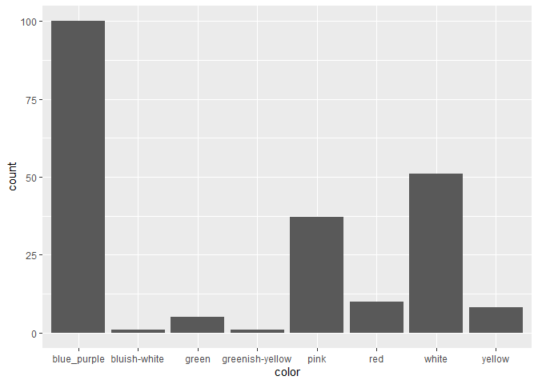
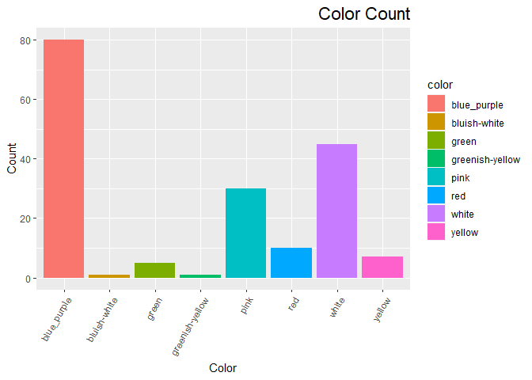
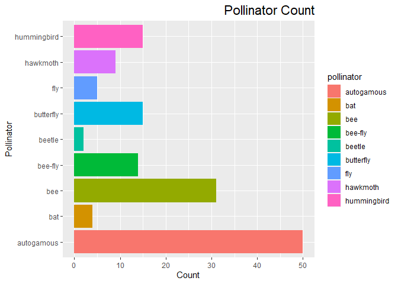

```r
getwd()
```

```
## [1] "C:/Users/jalat/Desktop/BIS15W2021_Group4_Project"
```


#Library

```r
library(tidyverse)
```

```
## -- Attaching packages --------------------------------------- tidyverse 1.3.0 --
```

```
## v ggplot2 3.3.3     v purrr   0.3.4
## v tibble  3.0.6     v dplyr   1.0.4
## v tidyr   1.1.2     v stringr 1.4.0
## v readr   1.4.0     v forcats 0.5.1
```

```
## -- Conflicts ------------------------------------------ tidyverse_conflicts() --
## x dplyr::filter() masks stats::filter()
## x dplyr::lag()    masks stats::lag()
```

```r
library(RColorBrewer)
library(paletteer)
library(janitor)
```

```
## 
## Attaching package: 'janitor'
```

```
## The following objects are masked from 'package:stats':
## 
##     chisq.test, fisher.test
```

```r
library(here)
```

```
## here() starts at C:/Users/jalat/Desktop/BIS15W2021_Group4_Project
```

```r
library(naniar)
library(stringr)
```

#Data

```r
flower_sizes_original <- read_csv(here("Plant+Pollinators Data", "Flower size measurements.csv")) %>% janitor::clean_names()
```

```
## 
## -- Column specification --------------------------------------------------------
## cols(
##   `Herbarium accession sheet` = col_character(),
##   Species = col_character(),
##   `Flower number` = col_double(),
##   `Corolla length (cm)` = col_double(),
##   `Corolla width throat (cm)` = col_double(),
##   `Mean corolla length (cm)` = col_double(),
##   `Standard Deviation corolla length (cm)` = col_double(),
##   `Mean corolla width (cm)` = col_double(),
##   `Standard deviation  corolla width (cm)` = col_double(),
##   `Length width ratio` = col_double()
## )
```

```r
colors_and_pollinators_original <- read_csv(here("Plant+Pollinators Data", "Pollinator and flower color.csv")) %>% janitor::clean_names()
```

```
## Warning: Duplicated column names deduplicated: 'Source' => 'Source_1' [5]
```

```
## 
## -- Column specification --------------------------------------------------------
## cols(
##   Species = col_character(),
##   Color = col_character(),
##   Source = col_character(),
##   Pollinator = col_character(),
##   Source_1 = col_character()
## )
```

#Flower sizes data

```r
flower_sizes <- flower_sizes_original%>% 
  select(herbarium_accession_sheet, species, flower_number, corolla_length_cm, corolla_width_throat_cm) %>% 
  filter(herbarium_accession_sheet != "NA") %>% 
  filter(corolla_length_cm != "NA", corolla_width_throat_cm != "NA")
flower_sizes
```

```
## # A tibble: 3,006 x 5
##    herbarium_accessio~ species   flower_number corolla_length_~ corolla_width_t~
##    <chr>               <chr>             <dbl>            <dbl>            <dbl>
##  1 Acanthogilia glori~ Acanthog~             1             3.55            0.393
##  2 Acanthogilia glori~ Acanthog~             1             3.70            0.455
##  3 Acanthogilia glori~ Acanthog~             2             2.66            0.37 
##  4 Acanthogilia glori~ Acanthog~             3             2.87            0.375
##  5 Aliciella caespito~ Aliciell~             1             1.65            0.241
##  6 Aliciella caespito~ Aliciell~             2             1.66            0.148
##  7 Aliciella caespito~ Aliciell~             3             1.88            0.201
##  8 Aliciella formosa ~ Aliciell~             1             1.97            0.201
##  9 Aliciella formosa ~ Aliciell~             2             2.12            0.286
## 10 Aliciella formosa ~ Aliciell~             3             2.05            0.23 
## # ... with 2,996 more rows
```

```r
glimpse(flower_sizes)
```

```
## Rows: 3,006
## Columns: 5
## $ herbarium_accession_sheet <chr> "Acanthogilia gloriosa KANU00172801", "Acant~
## $ species                   <chr> "Acanthogilia gloriosa", "Acanthogilia glori~
## $ flower_number             <dbl> 1, 1, 2, 3, 1, 2, 3, 1, 2, 3, 1, 2, 3, 1, 2,~
## $ corolla_length_cm         <dbl> 3.552, 3.696, 2.660, 2.874, 1.652, 1.664, 1.~
## $ corolla_width_throat_cm   <dbl> 0.393, 0.455, 0.370, 0.375, 0.241, 0.148, 0.~
```

```r
miss_var_summary(flower_sizes)
```

```
## # A tibble: 5 x 3
##   variable                  n_miss pct_miss
##   <chr>                      <int>    <dbl>
## 1 herbarium_accession_sheet      0        0
## 2 species                        0        0
## 3 flower_number                  0        0
## 4 corolla_length_cm              0        0
## 5 corolla_width_throat_cm        0        0
```


```r
#any_na(flower_sizes)
```


```r
flower_sizes_calculated <- flower_sizes %>% 
  group_by(species) %>% 
  summarise(mean_corolla_length_cm = mean(corolla_length_cm, na.rm = TRUE),
         std_dev_corolla_length = sd(corolla_length_cm, na.rm = TRUE),
         mean_corolla_width_throat_cm = mean(corolla_width_throat_cm, na.rm = TRUE),
         std_dev_corolla_width_throat = sd(corolla_width_throat_cm, na.rm = TRUE),
         mean_length_width_ratio = mean_corolla_length_cm/mean_corolla_width_throat_cm) %>% 
  select(species, mean_corolla_length_cm, std_dev_corolla_length, mean_corolla_width_throat_cm, std_dev_corolla_width_throat, mean_length_width_ratio)
flower_sizes_calculated
```

```
## # A tibble: 396 x 6
##    species  mean_corolla_len~ std_dev_corolla~ mean_corolla_wi~ std_dev_corolla~
##    <chr>                <dbl>            <dbl>            <dbl>            <dbl>
##  1 Acantho~             3.20            0.506            0.398            0.0391
##  2 Aliciel~             1.73            0.131            0.197            0.0467
##  3 Aliciel~             2.12            0.0894           0.297            0.0645
##  4 Aliciel~             1.58            0.408            0.209            0.0706
##  5 Aliciel~             1.11            0.295            0.145            0.0258
##  6 Aliciel~             0.818           0.129            0.158            0.0640
##  7 Aliciel~             0.556           0.0207           0.0963           0.0205
##  8 Aliciel~             0.518           0.110            0.0963           0.0220
##  9 Aliciel~             0.636           0.0187           0.128            0.0255
## 10 Aliciel~             0.665           0.0471           0.141            0.0122
## # ... with 386 more rows, and 1 more variable: mean_length_width_ratio <dbl>
```

```r
#Check to see if this is the correct number of species :) 
n_distinct(flower_sizes_original$species)
```

```
## [1] 397
```

#There are 397 species in our data. Object `flower_sizes_calculated` should be used for the merge. 


#Pollinator and Color Data

```r
colors_and_pollinators <- colors_and_pollinators_original %>% 
  rename(color_source="source", pollinator_source="source_1") %>% 
  filter(color != "NA", pollinator != "NA")
names(colors_and_pollinators)
```

```
## [1] "species"           "color"             "color_source"     
## [4] "pollinator"        "pollinator_source"
```


```r
glimpse(colors_and_pollinators)
```

```
## Rows: 192
## Columns: 5
## $ species           <chr> "Acanthogilia gloriosa", "Aliciella caespitosa", "Al~
## $ color             <chr> "white", "red", "white", "white", "white", "blue", "~
## $ color_source      <chr> "Hsu and Hall 2003", "Porter 1998", "Porter 1998", "~
## $ pollinator        <chr> "hummingbird", "hummingbird", "autogamous", "autogam~
## $ pollinator_source <chr> "Hsu and Hall 2003", "Grant and Grant 1965", "Grant ~
```

```r
n_distinct(colors_and_pollinators$species)
```

```
## [1] 192
```

```r
miss_var_summary(colors_and_pollinators)
```

```
## # A tibble: 5 x 3
##   variable          n_miss pct_miss
##   <chr>              <int>    <dbl>
## 1 species                0        0
## 2 color                  0        0
## 3 color_source           0        0
## 4 pollinator             0        0
## 5 pollinator_source      0        0
```
#There are 429 distinct species in the`colors_and_pollinators` data and 397 in the `flower_size` data. We will use inner_join so that we are only working with species that have data in both data sets.

#The Merge

```r
phlox_merge <- inner_join(flower_sizes_calculated, colors_and_pollinators, by = "species")
phlox_merge
```

```
## # A tibble: 145 x 10
##    species  mean_corolla_len~ std_dev_corolla~ mean_corolla_wi~ std_dev_corolla~
##    <chr>                <dbl>            <dbl>            <dbl>            <dbl>
##  1 Acantho~             3.20            0.506            0.398           0.0391 
##  2 Aliciel~             1.73            0.131            0.197           0.0467 
##  3 Aliciel~             0.818           0.129            0.158           0.0640 
##  4 Aliciel~             0.518           0.110            0.0963          0.0220 
##  5 Aliciel~             0.213           0.0110           0.0427          0.00569
##  6 Aliciel~             0.609           0.0376           0.162           0.0202 
##  7 Aliciel~             1.55            0.167            0.228           0.0323 
##  8 Allophy~             0.650           0.0309           0.139           0.0523 
##  9 Allophy~             0.611           0.498            0.121           0.147  
## 10 Allophy~             0.685           0.0962           0.114           0.0169 
## # ... with 135 more rows, and 5 more variables: mean_length_width_ratio <dbl>,
## #   color <chr>, color_source <chr>, pollinator <chr>, pollinator_source <chr>
```
#After joining, we have 293 species that we are working with. 

#It's Plotty Time!

```r
phlox_merge %>% 
  count(color)
```

```
## # A tibble: 27 x 2
##    color                            n
##  * <chr>                        <int>
##  1 blue                            16
##  2 blue-purple                      8
##  3 blue-purple and white (both)     1
##  4 blue-purple to white             1
##  5 blue-violet                      1
##  6 bluish-white                     1
##  7 green                            5
##  8 greenish-yellow                  1
##  9 light blue                       1
## 10 light pink                       2
## # ... with 17 more rows
```

```r
phlox_merge_test_color <- phlox_merge %>%
  mutate_all(funs(str_replace(., " or ", ", "))) %>%
  mutate_all(funs(str_replace(., " and ", ", "))) %>%
  mutate_all(funs(str_replace(., "/", ", "))) %>%
  mutate_all(funs(str_replace(., " to ", ", "))) %>%
  separate(color, into=c("color_1", "color_2", "color_3", "color_4"), sep=", ") %>%
  mutate_all(funs(str_replace(., " primary,", ", "))) %>%
  mutate_all(funs(str_replace(., " secondary", ""))) %>%
  mutate_all(funs(str_replace(., "bees", "bee"))) %>%
  mutate_all(funs(str_replace(., "butterflies", "butterfly"))) %>%
  mutate_all(funs(str_replace(., "beeflies", "bee-fly"))) %>%
  mutate_all(funs(str_replace(., "beefly", "bee-fly"))) %>%
  mutate_all(funs(str_replace(., "beetles", "beetle"))) %>% 
  mutate_all(funs(str_replace(., "hawkmoths", "hawkmoth"))) %>% 
  mutate_all(funs(str_replace(., "flies", "fly"))) %>% 
  mutate_all(funs(str_replace(., "hummingbirds", "hummingbird"))) %>% 
  separate(pollinator, into=c("pollinator_1", "pollinator_2", "pollinator_3"), sep=",")
```

```
## Warning: `funs()` was deprecated in dplyr 0.8.0.
## Please use a list of either functions or lambdas: 
## 
##   # Simple named list: 
##   list(mean = mean, median = median)
## 
##   # Auto named with `tibble::lst()`: 
##   tibble::lst(mean, median)
## 
##   # Using lambdas
##   list(~ mean(., trim = .2), ~ median(., na.rm = TRUE))
```

```
## Warning: Expected 4 pieces. Missing pieces filled with `NA` in 144 rows [1, 2,
## 3, 4, 5, 6, 7, 8, 9, 10, 11, 12, 13, 14, 15, 16, 17, 18, 19, 20, ...].
```

```
## Warning: Expected 3 pieces. Additional pieces discarded in 1 rows [96].
```

```
## Warning: Expected 3 pieces. Missing pieces filled with `NA` in 143 rows [1, 2,
## 3, 4, 5, 6, 7, 8, 9, 10, 11, 12, 13, 14, 15, 16, 17, 18, 19, 20, ...].
```

```r
phlox_merge_test_color
```

```
## # A tibble: 145 x 15
##    species  mean_corolla_len~ std_dev_corolla~ mean_corolla_wi~ std_dev_corolla~
##    <chr>    <chr>             <chr>            <chr>            <chr>           
##  1 Acantho~ 3.1955            0.5058705367977~ 0.39825          0.0391013640000~
##  2 Aliciel~ 1.73366666666667  0.1311957824525~ 0.1966666666666~ 0.0466511879091~
##  3 Aliciel~ 0.8175            0.1288716415663~ 0.1583333333333~ 0.0640145816721~
##  4 Aliciel~ 0.518             0.1099602200798~ 0.0963333333333~ 0.0219601912559~
##  5 Aliciel~ 0.213             0.011            0.0426666666666~ 0.0056862407030~
##  6 Aliciel~ 0.6095            0.0375752578168~ 0.1625           0.0201866292381~
##  7 Aliciel~ 1.5465            0.1665713943381~ 0.2278888888888~ 0.0322761774996~
##  8 Allophy~ 0.650333333333333 0.0308922859842~ 0.1386666666666~ 0.0523099735550~
##  9 Allophy~ 0.611433333333333 0.4976104752288~ 0.1206333333333~ 0.1472439878365~
## 10 Allophy~ 0.685             0.0962392851178~ 0.1145           0.0169440254957~
## # ... with 135 more rows, and 10 more variables: mean_length_width_ratio <chr>,
## #   color_1 <chr>, color_2 <chr>, color_3 <chr>, color_4 <chr>,
## #   color_source <chr>, pollinator_1 <chr>, pollinator_2 <chr>,
## #   pollinator_3 <chr>, pollinator_source <chr>
```


```r
phlox_merge_test_color2 <- phlox_merge_test_color %>%
  mutate_all(funs(str_replace(., "light pink", "pink"))) %>%
  mutate_all(funs(str_replace(., "pale pink", "pink"))) %>%
  mutate_all(funs(str_replace(., "yellow throat", "yellow"))) %>%
  mutate_all(funs(str_replace(., "lavender", "blue_purple"))) %>%
  mutate_all(funs(str_replace(., "blue-violet", "blue_purple"))) %>%
  mutate_all(funs(str_replace(., "pale violet", "blue_purple"))) %>%
  mutate_all(funs(str_replace(., "violet", "blue_purple"))) %>%
  mutate_all(funs(str_replace(., "blue-purple", "blue_purple"))) %>%
  mutate_all(funs(str_replace(., "purple-blue", "blue_purple"))) %>%
  mutate_all(funs(str_replace(., "light purple", "blue_purple"))) %>%
  mutate_all(funs(str_replace(., "pale purple", "blue_purple"))) %>%
  mutate_all(funs(str_replace(., "pinkish purple", "blue_purple"))) %>%
  mutate_all(funs(str_replace(., "pale blue", "blue_purple"))) %>% 
  mutate_all(funs(str_replace(., "light blue", "blue_purple"))) %>%
  mutate_all(funs(str_replace(., "purple", "blue_purple"))) %>% 
  mutate_all(funs(str_replace(., "blue", "blue_purple"))) %>% 
  mutate_all(funs(str_replace(., "blue_purple_blue_purple", "blue_purple"))) %>%
  mutate_all(funs(str_replace(., "blue_purple_purple", "blue_purple"))) %>%
  mutate_all(funs(str_replace(., " [(]both[)]", "")))
phlox_merge_test_color2
```

```
## # A tibble: 145 x 15
##    species  mean_corolla_len~ std_dev_corolla~ mean_corolla_wi~ std_dev_corolla~
##    <chr>    <chr>             <chr>            <chr>            <chr>           
##  1 Acantho~ 3.1955            0.5058705367977~ 0.39825          0.0391013640000~
##  2 Aliciel~ 1.73366666666667  0.1311957824525~ 0.1966666666666~ 0.0466511879091~
##  3 Aliciel~ 0.8175            0.1288716415663~ 0.1583333333333~ 0.0640145816721~
##  4 Aliciel~ 0.518             0.1099602200798~ 0.0963333333333~ 0.0219601912559~
##  5 Aliciel~ 0.213             0.011            0.0426666666666~ 0.0056862407030~
##  6 Aliciel~ 0.6095            0.0375752578168~ 0.1625           0.0201866292381~
##  7 Aliciel~ 1.5465            0.1665713943381~ 0.2278888888888~ 0.0322761774996~
##  8 Allophy~ 0.650333333333333 0.0308922859842~ 0.1386666666666~ 0.0523099735550~
##  9 Allophy~ 0.611433333333333 0.4976104752288~ 0.1206333333333~ 0.1472439878365~
## 10 Allophy~ 0.685             0.0962392851178~ 0.1145           0.0169440254957~
## # ... with 135 more rows, and 10 more variables: mean_length_width_ratio <chr>,
## #   color_1 <chr>, color_2 <chr>, color_3 <chr>, color_4 <chr>,
## #   color_source <chr>, pollinator_1 <chr>, pollinator_2 <chr>,
## #   pollinator_3 <chr>, pollinator_source <chr>
```


```r
n_distinct(phlox_merge_test_color$species)
```

```
## [1] 145
```


```r
phlox_long <- phlox_merge_test_color2 %>% 
  pivot_longer(color_1:color_4,
               names_to = "color_number",
               values_to = "color") %>% 
  pivot_longer(pollinator_1:pollinator_3,
               names_to = "pollinator_number",
               values_to = "pollinator") %>%
  select(-color_number, -pollinator_number) %>%
  filter(color!="NA" & pollinator!="NA")
phlox_long
```

```
## # A tibble: 213 x 10
##    species  mean_corolla_len~ std_dev_corolla~ mean_corolla_wi~ std_dev_corolla~
##    <chr>    <chr>             <chr>            <chr>            <chr>           
##  1 Acantho~ 3.1955            0.5058705367977~ 0.39825          0.0391013640000~
##  2 Aliciel~ 1.73366666666667  0.1311957824525~ 0.1966666666666~ 0.0466511879091~
##  3 Aliciel~ 0.8175            0.1288716415663~ 0.1583333333333~ 0.0640145816721~
##  4 Aliciel~ 0.518             0.1099602200798~ 0.0963333333333~ 0.0219601912559~
##  5 Aliciel~ 0.213             0.011            0.0426666666666~ 0.0056862407030~
##  6 Aliciel~ 0.6095            0.0375752578168~ 0.1625           0.0201866292381~
##  7 Aliciel~ 1.5465            0.1665713943381~ 0.2278888888888~ 0.0322761774996~
##  8 Allophy~ 0.650333333333333 0.0308922859842~ 0.1386666666666~ 0.0523099735550~
##  9 Allophy~ 0.611433333333333 0.4976104752288~ 0.1206333333333~ 0.1472439878365~
## 10 Allophy~ 0.685             0.0962392851178~ 0.1145           0.0169440254957~
## # ... with 203 more rows, and 5 more variables: mean_length_width_ratio <chr>,
## #   color_source <chr>, pollinator_source <chr>, color <chr>, pollinator <chr>
```
Adding genus col data:

```r
genus_name <-phlox_long$genus <- word(phlox_long$species, 1)
phlox_long %>% 
  tabyl(genus)
```

```
##          genus  n     percent
##   Acanthogilia  1 0.004694836
##      Aliciella  6 0.028169014
##    Allophyllum  6 0.028169014
##     Bonplandia  1 0.004694836
##         Cantua  4 0.018779343
##         Cobaea  9 0.042253521
##       Collomia  6 0.028169014
##          Dayia  3 0.014084507
##      Eriastrum  7 0.032863850
##     Fouquieria  1 0.004694836
##          Gilia 33 0.154929577
##     Giliastrum  2 0.009389671
##    Gymnosteris  3 0.014084507
##      Ipomopsis 17 0.079812207
##     Langloisia  2 0.009389671
##    Leptosiphon 17 0.079812207
##      Linanthus  8 0.037558685
##       Loeselia  1 0.004694836
##  Loeseliastrum  3 0.014084507
##     Microgilia  1 0.004694836
##    Microsteris  1 0.004694836
##     Navarretia 12 0.056338028
##          Phlox 45 0.211267606
##     Polemonium 22 0.103286385
##     Saltugilia  2 0.009389671
```

```r
#Dataframe1$COL2 <- word(Dataframe2$COL1, 1)
```


```r
phlox_long %>% 
  ggplot(aes(x= color))+
  geom_bar()
```

<!-- -->

```r
phlox_long %>%
  count(species, color) %>%
  ggplot(aes(x= color, fill = color))+
  geom_bar()+
  theme(axis.text.x = element_text(angle = 60, hjust = 1))+
  labs(title = "Color Count",
       x = "Color",
       y = "Count") +
  theme(plot.title = element_text(size = rel(1.5), hjust = 1))
```

<!-- -->


```r
phlox_long %>% 
  count(species, pollinator) %>%
  ggplot(aes(x=pollinator))+
  geom_bar()+
  coord_flip()+
  labs(title = "Pollinator Count",
       x = "Pollinator",
       y = "Count") +
  theme(plot.title = element_text(size = rel(1.5), hjust = 1))
```

<!-- -->

```r
phlox_long %>% 
  filter(pollinator == "bee"| pollinator == "bee-fly" | pollinator == "hummingbird" | pollinator == "hawkmoth" | pollinator == "fly" | pollinator == "butterfly" | pollinator == "beetle" | pollinator == "bat" | pollinator == "autogamous") %>% 
  count(species, pollinator) %>%
  ggplot(aes(x=pollinator, fill=pollinator))+
  geom_bar()+
  coord_flip()+
  labs(title = "Pollinator Count",
       x = "Pollinator",
       y = "Count") +
  theme(plot.title = element_text(size = rel(1.5), hjust = 1))
```

<!-- -->


Note that the `echo = FALSE` parameter was added to the code chunk to prevent printing of the R code that generated the plot.
