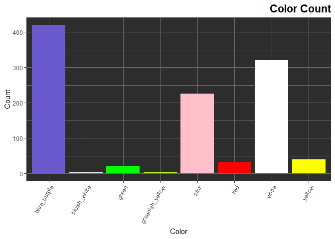
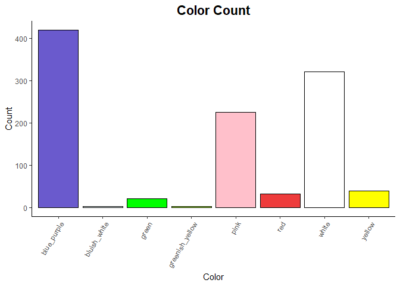

**Installing Libraries if Necessary (for non-frequent R users)

```r
if (!require("tidyverse")) install.packages('tidyverse')
```

```
## Loading required package: tidyverse
```

```
## -- Attaching packages --------------------------------------- tidyverse 1.3.0 --
```

```
## v ggplot2 3.3.3     v purrr   0.3.4
## v tibble  3.0.6     v dplyr   1.0.4
## v tidyr   1.1.2     v stringr 1.4.0
## v readr   1.4.0     v forcats 0.5.1
```

```
## -- Conflicts ------------------------------------------ tidyverse_conflicts() --
## x dplyr::filter() masks stats::filter()
## x dplyr::lag()    masks stats::lag()
```

```r
if (!require("RColorBrewer")) install.packages('RColorBrewer')
```

```
## Loading required package: RColorBrewer
```

```r
if (!require("paletteer")) install.packages('paletteer')
```

```
## Loading required package: paletteer
```

```r
if (!require("janitor")) install.packages('janitor')
```

```
## Loading required package: janitor
```

```
## 
## Attaching package: 'janitor'
```

```
## The following objects are masked from 'package:stats':
## 
##     chisq.test, fisher.test
```

```r
if (!require("here")) install.packages('here')
```

```
## Loading required package: here
```

```
## here() starts at C:/Users/jalat/Desktop/BIS15W2021_Group4_Project
```

```r
if (!require("naniar")) install.packages('naniar')
```

```
## Loading required package: naniar
```

```r
if (!require("stringr")) install.packages('stringr')
if (!require("shiny")) install.packages('shiny')
```

```
## Loading required package: shiny
```

```r
if (!require("shinydashboard")) install.packages('shinydashboard')
```

```
## Loading required package: shinydashboard
```

```
## 
## Attaching package: 'shinydashboard'
```

```
## The following object is masked from 'package:graphics':
## 
##     box
```

#Library

```r
library(tidyverse)
library(RColorBrewer)
library(paletteer)
library(janitor)
library(here)
library(naniar)
library(stringr)
library(shiny)
library(shinydashboard)
```

#Loading Original Data Sets
The following data sets examine the pollinators, colors, and sizes associated with different species of flowers within the phlox family. Source: Landis, Jacob B. et al. (2018), Evolution of floral traits and impact of reproductive mode on diversification in the phlox family (Polemoniaceae), Molecular Phylogenetics and Evolution, Article-journal, https://doi.org/10.1016/j.ympev.2018.06.035
[Data:](https://datadryad.org/stash/dataset/doi:10.5061/dryad.2710pk5)

```r
flower_sizes_original <- read_csv(here("Plant+Pollinators Data", "Flower size measurements.csv")) %>%
  janitor::clean_names()
colors_and_pollinators_original <- read_csv(here("Plant+Pollinators Data", "Pollinator and flower color.csv")) %>%
  janitor::clean_names()
```

#Flower Sizes Data
With the first data set, we'll observe the lengths and widths of each species' corollas, removing any NAs recorded for these variables.

```r
flower_sizes <- flower_sizes_original %>% 
  select(herbarium_accession_sheet, species, flower_number, corolla_length_cm, corolla_width_throat_cm) %>% 
  filter(corolla_length_cm != "NA", corolla_width_throat_cm != "NA")
flower_sizes
```

```
# A tibble: 3,006 x 5
   herbarium_accessio~ species   flower_number corolla_length_~ corolla_width_t~
   <chr>               <chr>             <dbl>            <dbl>            <dbl>
 1 Acanthogilia glori~ Acanthog~             1             3.55            0.393
 2 Acanthogilia glori~ Acanthog~             1             3.70            0.455
 3 Acanthogilia glori~ Acanthog~             2             2.66            0.37 
 4 Acanthogilia glori~ Acanthog~             3             2.87            0.375
 5 Aliciella caespito~ Aliciell~             1             1.65            0.241
 6 Aliciella caespito~ Aliciell~             2             1.66            0.148
 7 Aliciella caespito~ Aliciell~             3             1.88            0.201
 8 Aliciella formosa ~ Aliciell~             1             1.97            0.201
 9 Aliciella formosa ~ Aliciell~             2             2.12            0.286
10 Aliciella formosa ~ Aliciell~             3             2.05            0.23 
# ... with 2,996 more rows
```

```r
glimpse(flower_sizes)
```

```
Rows: 3,006
Columns: 5
$ herbarium_accession_sheet <chr> "Acanthogilia gloriosa KANU00172801", "Acant~
$ species                   <chr> "Acanthogilia gloriosa", "Acanthogilia glori~
$ flower_number             <dbl> 1, 1, 2, 3, 1, 2, 3, 1, 2, 3, 1, 2, 3, 1, 2,~
$ corolla_length_cm         <dbl> 3.552, 3.696, 2.660, 2.874, 1.652, 1.664, 1.~
$ corolla_width_throat_cm   <dbl> 0.393, 0.455, 0.370, 0.375, 0.241, 0.148, 0.~
```

```r
flower_sizes %>%
  miss_var_summary() #This is to confirm that we have removed all NAs represented as "NA" from the size columns, as well as to get a count of any other NAs in the remaining columns
```

```
# A tibble: 5 x 3
  variable                  n_miss pct_miss
  <chr>                      <int>    <dbl>
1 herbarium_accession_sheet      0        0
2 species                        0        0
3 flower_number                  0        0
4 corolla_length_cm              0        0
5 corolla_width_throat_cm        0        0
```


```r
flower_sizes_calculated <- flower_sizes %>% 
  group_by(species) %>% 
  summarise(mean_corolla_length_cm = mean(corolla_length_cm, na.rm = TRUE),
         std_dev_corolla_length = sd(corolla_length_cm, na.rm = TRUE),
         mean_corolla_width_throat_cm = mean(corolla_width_throat_cm, na.rm = TRUE),
         std_dev_corolla_width_throat = sd(corolla_width_throat_cm, na.rm = TRUE),
         mean_length_width_ratio = mean_corolla_length_cm/mean_corolla_width_throat_cm)
flower_sizes_calculated #summary of sizes for each species
```

```
# A tibble: 396 x 6
   species  mean_corolla_len~ std_dev_corolla~ mean_corolla_wi~ std_dev_corolla~
 * <chr>                <dbl>            <dbl>            <dbl>            <dbl>
 1 Acantho~             3.20            0.506            0.398            0.0391
 2 Aliciel~             1.73            0.131            0.197            0.0467
 3 Aliciel~             2.12            0.0894           0.297            0.0645
 4 Aliciel~             1.58            0.408            0.209            0.0706
 5 Aliciel~             1.11            0.295            0.145            0.0258
 6 Aliciel~             0.818           0.129            0.158            0.0640
 7 Aliciel~             0.556           0.0207           0.0963           0.0205
 8 Aliciel~             0.518           0.110            0.0963           0.0220
 9 Aliciel~             0.636           0.0187           0.128            0.0255
10 Aliciel~             0.665           0.0471           0.141            0.0122
# ... with 386 more rows, and 1 more variable: mean_length_width_ratio <dbl>
```

```r
n_distinct(flower_sizes_calculated$species)
```

```
[1] 396
```
There are 396 species in our data. Object `flower_sizes_calculated` should be used for the merge. 

#Pollinator and Color Data
With our second data set, we'll observe the different colors and pollinators associated with each species. Note: this data is not yet clean.

```r
colors_and_pollinators <- colors_and_pollinators_original %>% 
  rename(color_source="source", pollinator_source="source_1") #%>% 
  #filter(color != "NA" & pollinator != "NA")
colors_and_pollinators
```

```
# A tibble: 429 x 5
   species                color color_source      pollinator pollinator_source  
   <chr>                  <chr> <chr>             <chr>      <chr>              
 1 Acanthogilia gloriosa  white Hsu and Hall 2003 hummingbi~ Hsu and Hall 2003  
 2 Aliciella caespitosa   red   Porter 1998       hummingbi~ Grant and Grant 19~
 3 Aliciella formosa      pink  Porter 1998       <NA>       <NA>               
 4 Aliciella haydenii     pink  Porter 1998       <NA>       <NA>               
 5 Aliciella heterostyla  pink  Porter 1998       <NA>       <NA>               
 6 Aliciella hutchinsifo~ white Porter 1998       autogamous Grant and Grant 19~
 7 Aliciella latifolia    pink  Porter 1998       <NA>       <NA>               
 8 Aliciella leptomeria   white Porter 1998       autogamous Grant and Grant 19~
 9 Aliciella lottiae      white Porter 1998       <NA>       <NA>               
10 Aliciella mcvickerae   blue  Porter 1998       <NA>       <NA>               
# ... with 419 more rows
```

```r
glimpse(colors_and_pollinators)
```

```
Rows: 429
Columns: 5
$ species           <chr> "Acanthogilia gloriosa", "Aliciella caespitosa", "Al~
$ color             <chr> "white", "red", "pink", "pink", "pink", "white", "pi~
$ color_source      <chr> "Hsu and Hall 2003", "Porter 1998", "Porter 1998", "~
$ pollinator        <chr> "hummingbird", "hummingbird", NA, NA, NA, "autogamou~
$ pollinator_source <chr> "Hsu and Hall 2003", "Grant and Grant 1965", NA, NA,~
```

```r
n_distinct(colors_and_pollinators$species)
```

```
[1] 429
```

```r
miss_var_summary(colors_and_pollinators)
```

```
# A tibble: 5 x 3
  variable          n_miss pct_miss
  <chr>              <int>    <dbl>
1 pollinator           237     55.2
2 pollinator_source    237     55.2
3 species                0      0  
4 color                  0      0  
5 color_source           0      0  
```
There are 429 distinct species in the `colors_and_pollinators` data and 397 in the `flower_size` data. We will use inner_join so that we are only working with species that have data in both data sets.

#The Merge

```r
phlox_merge <- inner_join(flower_sizes_calculated, colors_and_pollinators, by = "species")
phlox_merge
```

```
# A tibble: 292 x 10
   species  mean_corolla_len~ std_dev_corolla~ mean_corolla_wi~ std_dev_corolla~
   <chr>                <dbl>            <dbl>            <dbl>            <dbl>
 1 Acantho~             3.20            0.506            0.398            0.0391
 2 Aliciel~             1.73            0.131            0.197            0.0467
 3 Aliciel~             2.12            0.0894           0.297            0.0645
 4 Aliciel~             1.58            0.408            0.209            0.0706
 5 Aliciel~             1.11            0.295            0.145            0.0258
 6 Aliciel~             0.818           0.129            0.158            0.0640
 7 Aliciel~             0.556           0.0207           0.0963           0.0205
 8 Aliciel~             0.518           0.110            0.0963           0.0220
 9 Aliciel~             0.636           0.0187           0.128            0.0255
10 Aliciel~             0.665           0.0471           0.141            0.0122
# ... with 282 more rows, and 5 more variables: mean_length_width_ratio <dbl>,
#   color <chr>, color_source <chr>, pollinator <chr>, pollinator_source <chr>
```
After joining, we have 292 species that we are working with. 

#Tidying Up the Data
Now that we have our two data sets merged, we can now tidy our data so that it fits the 3 conventions of the tidyverse: (1) each variable has its own column, (2) each observation has its own row, (3) each value has its own cell.

We'll start off by giving each value its own cell and ensuring all observations are consistent by converting any plural observations to their singular forms.

```r
phlox_clean_up1 <- phlox_merge %>%
  mutate_all(funs(str_replace(., " or", ", "))) %>% #mutations 1-4 are used to ensure all cells with more than one value are using the same separators
  mutate_all(funs(str_replace(., " and", ", "))) %>%
  mutate_all(funs(str_replace(., "/", ", "))) %>%
  mutate_all(funs(str_replace(., " to", ", "))) %>%
  separate(color, into=c("color_1", "color_2", "color_3", "color_4"), sep=", ") %>% #there are a maximum of 4 different colors in one cell under the color column, so we will separate the original color column into 4 different rows to give each value its own cell
  mutate_all(funs(str_replace(., " primary,", ", "))) %>% #mutations 5-6 serve to remove extraneous verbiage that won't be relevant to our analysis
  mutate_all(funs(str_replace(., " secondary", ""))) %>%
  mutate_all(funs(str_replace(., "bees", "bee"))) %>% #mutations 7-26 serve to make our data consistent and turn any plural pollinators into singular
  mutate_all(funs(str_replace(., "butterflies", "butterfly"))) %>%
  mutate_all(funs(str_replace(., " butterfly", "butterfly"))) %>% #keep repeated mutations, otherwise it will count butterfly twice in n_distinct()
  mutate_all(funs(str_replace(., " butterfly", "butterfly"))) %>%
  mutate_all(funs(str_replace(., "beeflies", "bee-fly"))) %>%
  mutate_all(funs(str_replace(., "beefly", "bee-fly"))) %>%
  mutate_all(funs(str_replace(., "  bee-fly", "bee-fly"))) %>%
  mutate_all(funs(str_replace(., " bee-fly", "bee-fly"))) %>%
  mutate_all(funs(str_replace(., "beetles", "beetle"))) %>% 
  mutate_all(funs(str_replace(., " beetles", "beetle"))) %>%
  mutate_all(funs(str_replace(., "hawkmoths", "hawkmoth"))) %>% 
  mutate_all(funs(str_replace(., "  hawkmoth", "hawkmoth"))) %>% #keep repeated mutations, otherwise it will count hawkmoth twice in n_distinct()
  mutate_all(funs(str_replace(., " hawkmoth", "hawkmoth"))) %>%
  mutate_all(funs(str_replace(., "  bee", "bee"))) %>%
  mutate_all(funs(str_replace(., "flies", "fly"))) %>% 
  mutate_all(funs(str_replace(., " fly", "fly"))) %>% #keep repeated mutations, otherwise it will count fly twice in n_distinct()
  mutate_all(funs(str_replace(., " fly", "fly"))) %>%
  mutate_all(funs(str_replace(., "hummingbirds", "hummingbird"))) %>% 
  mutate_all(funs(str_replace(., " hummingbird", "hummingbird"))) %>% #keep repeated mutations, otherwise it will count hummingbird twice in n_distinct()
  mutate_all(funs(str_replace(., " hummingbird", "hummingbird"))) %>%
  separate(pollinator, into=c("pollinator_1", "pollinator_2", "pollinator_3"), sep=",") #there are a maximum of 3 different pollinators in one cell under the pollinator column, so we will separate the original pollinator column into 3 different rows to give each value its own cell
```

```
## Warning: `funs()` was deprecated in dplyr 0.8.0.
## Please use a list of either functions or lambdas: 
## 
##   # Simple named list: 
##   list(mean = mean, median = median)
## 
##   # Auto named with `tibble::lst()`: 
##   tibble::lst(mean, median)
## 
##   # Using lambdas
##   list(~ mean(., trim = .2), ~ median(., na.rm = TRUE))
```

```
## Warning: Expected 4 pieces. Missing pieces filled with `NA` in 291 rows [1, 2,
## 3, 4, 5, 6, 7, 8, 9, 10, 11, 12, 13, 14, 15, 16, 17, 18, 19, 20, ...].
```

```
## Warning: Expected 3 pieces. Additional pieces discarded in 1 rows [164].
```

```
## Warning: Expected 3 pieces. Missing pieces filled with `NA` in 143 rows [1, 2,
## 6, 8, 11, 14, 18, 21, 22, 23, 24, 25, 26, 28, 29, 34, 36, 37, 39, 41, ...].
```

```r
phlox_clean_up1
```

```
## # A tibble: 292 x 15
##    species  mean_corolla_len~ std_dev_corolla~ mean_corolla_wi~ std_dev_corolla~
##    <chr>    <chr>             <chr>            <chr>            <chr>           
##  1 Acantho~ 3.1955            0.5058705367977~ 0.39825          0.0391013640000~
##  2 Aliciel~ 1.73366666666667  0.1311957824525~ 0.1966666666666~ 0.0466511879091~
##  3 Aliciel~ 2.11688888888889  0.0894000062142~ 0.2972222222222~ 0.0644530406144~
##  4 Aliciel~ 1.581             0.4083356462519~ 0.2094666666666~ 0.0706195710092~
##  5 Aliciel~ 1.10816666666667  0.2946743400207~ 0.1446666666666~ 0.0257966406081~
##  6 Aliciel~ 0.8175            0.1288716415663~ 0.1583333333333~ 0.0640145816721~
##  7 Aliciel~ 0.556             0.0207243817760~ 0.0963333333333~ 0.0205365527779~
##  8 Aliciel~ 0.518             0.1099602200798~ 0.0963333333333~ 0.0219601912559~
##  9 Aliciel~ 0.636             0.0186815416922~ 0.1283333333333~ 0.0255016339345~
## 10 Aliciel~ 0.664666666666667 0.0470885690304~ 0.1413333333333~ 0.0122202018532~
## # ... with 282 more rows, and 10 more variables: mean_length_width_ratio <chr>,
## #   color_1 <chr>, color_2 <chr>, color_3 <chr>, color_4 <chr>,
## #   color_source <chr>, pollinator_1 <chr>, pollinator_2 <chr>,
## #   pollinator_3 <chr>, pollinator_source <chr>
```

We'll then do a more thorough clean-up under the color columns, making sure that all data is consistent here, as well.

```r
phlox_tidy <- phlox_clean_up1 %>%
  mutate_all(funs(str_replace(., "light pink", "pink"))) %>%
  mutate_all(funs(str_replace(., "pale pink", "pink"))) %>%
  mutate_all(funs(str_replace(., "pink,", "pink"))) %>%
  mutate_all(funs(str_replace(., "yellow throat", "yellow"))) %>%
  mutate_all(funs(str_replace(., "lavender", "blue_purple"))) %>%
  mutate_all(funs(str_replace(., "blue-violet", "blue_purple"))) %>%
  mutate_all(funs(str_replace(., "pale violet", "blue_purple"))) %>%
  mutate_all(funs(str_replace(., "violet", "blue_purple"))) %>%
  mutate_all(funs(str_replace(., "blue-purple", "blue_purple"))) %>%
  mutate_all(funs(str_replace(., "purple-blue", "blue_purple"))) %>%
  mutate_all(funs(str_replace(., "light purple", "blue_purple"))) %>%
  mutate_all(funs(str_replace(., "pale purple", "blue_purple"))) %>%
  mutate_all(funs(str_replace(., "pinkish purple", "blue_purple"))) %>%
  mutate_all(funs(str_replace(., "pale blue", "blue_purple"))) %>% 
  mutate_all(funs(str_replace(., "light blue", "blue_purple"))) %>%
  mutate_all(funs(str_replace(., "purple", "blue_purple"))) %>% 
  mutate_all(funs(str_replace(., "blue", "blue_purple"))) %>% 
  mutate_all(funs(str_replace(., "blue_purple_blue_purple", "blue_purple"))) %>%
  mutate_all(funs(str_replace(., "blue_purple_purple", "blue_purple"))) %>%
  mutate_all(funs(str_replace(., "bluish-white", "bluish_white"))) %>%
  mutate_all(funs(str_replace(., "greenish-yellow", "greenish_yellow"))) %>%
  mutate_all(funs(str_replace(., " blue_purple", "blue_purple"))) %>%
  mutate_all(funs(str_replace(., " pink", "pink"))) %>%
  mutate_all(funs(str_replace(., " white", "white"))) %>%
  mutate_all(funs(str_replace(., " [(]both[)]", "")))
phlox_tidy
```

```
## # A tibble: 292 x 15
##    species  mean_corolla_len~ std_dev_corolla~ mean_corolla_wi~ std_dev_corolla~
##    <chr>    <chr>             <chr>            <chr>            <chr>           
##  1 Acantho~ 3.1955            0.5058705367977~ 0.39825          0.0391013640000~
##  2 Aliciel~ 1.73366666666667  0.1311957824525~ 0.1966666666666~ 0.0466511879091~
##  3 Aliciel~ 2.11688888888889  0.0894000062142~ 0.2972222222222~ 0.0644530406144~
##  4 Aliciel~ 1.581             0.4083356462519~ 0.2094666666666~ 0.0706195710092~
##  5 Aliciel~ 1.10816666666667  0.2946743400207~ 0.1446666666666~ 0.0257966406081~
##  6 Aliciel~ 0.8175            0.1288716415663~ 0.1583333333333~ 0.0640145816721~
##  7 Aliciel~ 0.556             0.0207243817760~ 0.0963333333333~ 0.0205365527779~
##  8 Aliciel~ 0.518             0.1099602200798~ 0.0963333333333~ 0.0219601912559~
##  9 Aliciel~ 0.636             0.0186815416922~ 0.1283333333333~ 0.0255016339345~
## 10 Aliciel~ 0.664666666666667 0.0470885690304~ 0.1413333333333~ 0.0122202018532~
## # ... with 282 more rows, and 10 more variables: mean_length_width_ratio <chr>,
## #   color_1 <chr>, color_2 <chr>, color_3 <chr>, color_4 <chr>,
## #   color_source <chr>, pollinator_1 <chr>, pollinator_2 <chr>,
## #   pollinator_3 <chr>, pollinator_source <chr>
```
The pivot_longer() command will condense our dataframe so that, while still giving each value its own cell, all colors will be under a single column and all pollinators will be under its own single column. The object `phlox_long` is what we will now use for our analyses.

```r
phlox_long <- phlox_tidy %>% 
  pivot_longer(color_1:color_4,
               names_to = "color_number",
               values_to = "color") %>% 
  pivot_longer(pollinator_1:pollinator_3,
               names_to = "pollinator_number",
               values_to = "pollinator") %>%
  select(-color_number, -pollinator_number)
phlox_long
```

```
## # A tibble: 3,504 x 10
##    species  mean_corolla_len~ std_dev_corolla~ mean_corolla_wi~ std_dev_corolla~
##    <chr>    <chr>             <chr>            <chr>            <chr>           
##  1 Acantho~ 3.1955            0.5058705367977~ 0.39825          0.0391013640000~
##  2 Acantho~ 3.1955            0.5058705367977~ 0.39825          0.0391013640000~
##  3 Acantho~ 3.1955            0.5058705367977~ 0.39825          0.0391013640000~
##  4 Acantho~ 3.1955            0.5058705367977~ 0.39825          0.0391013640000~
##  5 Acantho~ 3.1955            0.5058705367977~ 0.39825          0.0391013640000~
##  6 Acantho~ 3.1955            0.5058705367977~ 0.39825          0.0391013640000~
##  7 Acantho~ 3.1955            0.5058705367977~ 0.39825          0.0391013640000~
##  8 Acantho~ 3.1955            0.5058705367977~ 0.39825          0.0391013640000~
##  9 Acantho~ 3.1955            0.5058705367977~ 0.39825          0.0391013640000~
## 10 Acantho~ 3.1955            0.5058705367977~ 0.39825          0.0391013640000~
## # ... with 3,494 more rows, and 5 more variables:
## #   mean_length_width_ratio <chr>, color_source <chr>, pollinator_source <chr>,
## #   color <chr>, pollinator <chr>
```

Adding genus col data:

```r
genus_name <-phlox_long$genus <- word(phlox_long$species, 1)
phlox_long %>% 
  tabyl(genus)
```

```
##          genus   n     percent
##   Acanthogilia  12 0.003424658
##      Aliciella 228 0.065068493
##    Allophyllum  60 0.017123288
##     Bonplandia  12 0.003424658
##    Bryantiella  12 0.003424658
##         Cantua  96 0.027397260
##         Cobaea 168 0.047945205
##       Collomia 132 0.037671233
##          Dayia  24 0.006849315
##      Eriastrum 156 0.044520548
##     Fouquieria  12 0.003424658
##          Gilia 336 0.095890411
##     Giliastrum  48 0.013698630
##    Gymnosteris  24 0.006849315
##      Ipomopsis 288 0.082191781
##     Langloisia  24 0.006849315
##    Lathrocasis  12 0.003424658
##    Leptosiphon 264 0.075342466
##   Leptosiphon,  12 0.003424658
##      Linanthus 228 0.065068493
##     Linanthus,  12 0.003424658
##       Loeselia 156 0.044520548
##  Loeseliastrum  36 0.010273973
##     Microgilia  12 0.003424658
##    Microsteris  12 0.003424658
##     Navarretia 276 0.078767123
##          Phlox 540 0.154109589
##         Phlox,  12 0.003424658
##     Polemonium 264 0.075342466
##     Saltugilia  36 0.010273973
```

```r
#Dataframe1$COL2 <- word(Dataframe2$COL1, 1)
```
#It's Plotty Time!
##Color Analysis

```r
phlox_long %>% 
  count(color)
```

```
## # A tibble: 9 x 2
##   color               n
## * <chr>           <int>
## 1 blue_purple       420
## 2 bluish_white        3
## 3 green              21
## 4 greenish_yellow     3
## 5 pink              225
## 6 red                33
## 7 white             321
## 8 yellow             39
## 9 <NA>             2439
```


```r
#played with the aesthetics a little to create the plot below this - they are the same data though, one needs to be deleted later
phlox_long %>%
  filter(color!="NA") %>%
  ggplot(aes(x=color, fill=color)) +
  geom_bar(show.legend = FALSE) + #removed legend because it just repeats what the x-axis says
  scale_fill_manual(values = c("blue_purple" = "slateblue",
                               "bluish_white" = "azure2",
                               "green" = "green",
                               "greenish_yellow" = "greenyellow",
                               "pink" = "pink",
                               "red" = "red",
                               "white" = "white",
                               "yellow" = "yellow")) +
  theme_dark() +
  theme(panel.background = element_rect(fill = "#2D2D2D"),
        axis.text.x = element_text(angle = 60, hjust = 1),
        plot.title=element_text(size = rel(1.5), face="bold", hjust=1)) +
  labs(title = "Color Count", x = "Color", y = "Count")
```

<!-- -->

```r
phlox_long %>%
  filter(color!="NA") %>%
  ggplot(aes(x=color, fill=color)) +
  geom_bar(color = "black", show.legend = FALSE) + #removed legend because it just repeats what the x-axis says 
  scale_fill_manual(values = c("blue_purple" = "slateblue",
                               "bluish_white" = "azure2",
                               "green" = "green",
                               "greenish_yellow" = "greenyellow",
                               "pink" = "pink",
                               "red" = "brown2",
                               "white" = "white",
                               "yellow" = "yellow")) +
  labs(title = "Color Count", x = "Color", y = "Count")+
  scale_color_grey() + theme_classic()+
  theme(plot.title = element_text(size = rel(1.5), hjust = .5))+
  theme(axis.text.x = element_text(angle = 60, hjust = 1),
        plot.title=element_text(size = rel(1.5), face="bold", hjust=.5))
```

<!-- -->

##Pollinator Analysis

```r
phlox_long %>% 
  filter(pollinator!="" & pollinator!="NA") %>%
  count(pollinator)
```

```
## # A tibble: 9 x 2
##   pollinator      n
## * <chr>       <int>
## 1 autogamous    200
## 2 bat            16
## 3 bee           152
## 4 bee-fly       108
## 5 beetle         12
## 6 butterfly      64
## 7 fly            36
## 8 hawkmoth       44
## 9 hummingbird    64
```


```r
phlox_long %>% 
  filter(pollinator!="NA" & pollinator!="") %>%
  ggplot(aes(x=pollinator, fill=pollinator))+
  geom_bar(color = "black", show.legend = FALSE)+
  scale_color_grey() + theme_classic()+
  scale_fill_manual(values = c("hummingbird" = "slateblue",
                               "hawkmoth" = "azure2",
                               "fly" = "chartreuse2",
                               "butterfly" = "pink",
                               "beetle" = "greenyellow",
                               "bee-fly" = "maroon",
                               "bee" = "yellow",
                               "bat" = "midnightblue",
                               "autogamous" = "mediumorchid1")) +
  labs(title = "Pollinator Count",
       x = "Pollinator",
       y = "Count") +
  theme(plot.title = element_text(size = rel(1.5), hjust = .5))+
  theme(axis.text.x = element_text(angle = 60, hjust = 1),
        plot.title=element_text(size = rel(1.5), face="bold", hjust=.5))
```

<!-- -->

```r
#Feel free to play with aesthetics
```
Looking at Pollinator With Our Continuous Variables Using a Box Plot:

```r
phlox_long %>% 
  filter(pollinator!="NA" & pollinator!="") %>%
  ggplot(aes(x=genus, y=mean_corolla_length_cm))+
  geom_boxplot()+
  scale_color_grey() + theme_classic()+
  labs(title = "Pollinator by Corolla Length",
       x = "Genus",
       y = "Corolla Length") +
  theme(plot.title = element_text(size = rel(1.5), hjust = .5))+
  theme(axis.text.x = element_text(angle = 60, hjust = 1),
        plot.title=element_text(size = rel(1.5), face="bold", hjust=.5))
```

<!-- -->

```r
phlox_long %>% 
  filter(pollinator!="NA" & pollinator!="") %>%
  ggplot(aes(x=genus, y=mean_corolla_width_throat_cm))+
  geom_boxplot()+
  scale_color_grey() + theme_classic()+
  labs(title = "Pollinator by Corolla Width",
       x = "Genus",
       y = "Corolla Width") +
  theme(plot.title = element_text(size = rel(1.5), hjust = .5))+
  theme(axis.text.x = element_text(angle = 60, hjust = 1),
        plot.title=element_text(size = rel(1.5), face="bold", hjust=.5))
```

<!-- -->

```r
phlox_long %>% 
  filter(pollinator!="NA" & pollinator!="") %>%
  ggplot(aes(x=genus, y=mean_length_width_ratio))+
  geom_boxplot()+
  scale_color_grey() + theme_classic()+
  labs(title = "Genus Corolla Length:Width",
       x = "Genus",
       y = "Corolla Length:Width") +
  theme(plot.title = element_text(size = rel(1.5), hjust = .5))+
  theme(axis.text.x = element_text(angle = 60, hjust = 1),
        plot.title=element_text(size = rel(1.5), face="bold", hjust=.5))
```

<!-- -->
Relating Pollinator to Color: 

```r
phlox_long %>% 
  filter(pollinator!="NA" & pollinator!="") %>%
  filter(color!="NA") %>%
  ggplot(aes(x = pollinator, fill = color)) + geom_bar(position = position_fill(), color = "black") +
  scale_color_grey() + theme_classic()+
  scale_fill_manual(values = c("blue_purple" = "slateblue",
                               "bluish_white" = "cadetblue1",
                               "green" = "green",
                               "greenish_yellow" = "greenyellow",
                               "pink" = "pink",
                               "red" = "brown2",
                               "white" = "white",
                               "yellow" = "yellow")) +
  labs(title = "Pollinator's Preferred Flower Color",
       x = "Pollinator",
       fill = "color")+
   theme(plot.title = element_text(size = rel(1.5), hjust = .5))+
  theme(axis.text.x = element_text(angle = 60, hjust = 1),
        plot.title=element_text(size = rel(1.5), face="bold", hjust=.5))
```

<!-- -->
We can start to see some trends in phlox data - we can see that phlox pollinators like hummingbird are overwhelmingly attracted to red flowers. 

Looking at Genus in Phlox Family:

```r
phlox_long %>% 
  count(genus)
```

```
## # A tibble: 30 x 2
##    genus            n
##  * <chr>        <int>
##  1 Acanthogilia    12
##  2 Aliciella      228
##  3 Allophyllum     60
##  4 Bonplandia      12
##  5 Bryantiella     12
##  6 Cantua          96
##  7 Cobaea         168
##  8 Collomia       132
##  9 Dayia           24
## 10 Eriastrum      156
## # ... with 20 more rows
```

```r
phlox_long %>% 
  filter(pollinator!="NA" & pollinator!="") %>%
  ggplot(aes(x = genus, fill = pollinator)) + geom_bar(position = position_fill(), color = "black") +
  scale_color_grey() + theme_classic()+
  scale_fill_manual(values = c("hummingbird" = "slateblue",
                               "hawkmoth" = "azure2",
                               "fly" = "chartreuse2",
                               "butterfly" = "pink",
                               "beetle" = "greenyellow",
                               "bee-fly" = "maroon",
                               "bee" = "yellow",
                               "bat" = "midnightblue",
                               "autogamous" = "mediumorchid1")) +
  labs(title = "Genus Pollinators",
       x = "Phylox Genus",
       fill = "color")+
   theme(plot.title = element_text(size = rel(1.5), hjust = .5))+
  theme(axis.text.x = element_text(angle = 60, hjust = 1),
        plot.title=element_text(size = rel(1.5), face="bold", hjust=.5))
```

<!-- -->


App Looking at Continuous Variables in the Plot:

```r
ui <- fluidPage(
    selectInput("x", "Select X Variable", choices = c("mean_corolla_length_cm", "mean_corolla_width_throat_cm", "mean_length_width_ratio"),
              selected = "bill_length_mm"),
    selectInput("y", "Select Y Variable", choices = c("mean_corolla_length_cm", "mean_corolla_width_throat_cm", "mean_length_width_ratio"),
              selected = "mean_corolla_length_cm"),
  plotOutput("plot", width = "1200px", height = "400px")
)

server <- function(input, output) {
  output$plot <- renderPlot({
    ggplot(phlox_long, aes_string(x = input$x, y = input$y, color="genus")) + 
      geom_point() + 
      scale_color_grey() + theme_classic()+
      theme_light(base_size = 18)+
      scale_x_discrete(breaks = seq(0, 10, 1))+
      scale_y_discrete(breaks = seq(0, 10, 1))
  })
}

shinyApp(ui, server)
```

`<div style="width: 100% ; height: 400px ; text-align: center; box-sizing: border-box; -moz-box-sizing: border-box; -webkit-box-sizing: border-box;" class="muted well">Shiny applications not supported in static R Markdown documents</div>`{=html}

choices = c("Acanthogilia", "Aliciella", "Allophyllum", "Bonplandia", "Cantua", "Cobaea", "Collomia", "Dayia", "Eriastrum", "Fouquieria", "Gilia", "Giliastrum", "Gymnosteris", "Ipomopsis", "Langloisia", "Leptosiphon", "Linanthus", "Loeselia", "Loeseliastrum", "Microgilia", "Microsteris", "Navarretia", "Phlox", "Polemonium", "Saltugilia")


Note that the `echo = FALSE` parameter was added to the code chunk to prevent printing of the R code that generated the plot.
